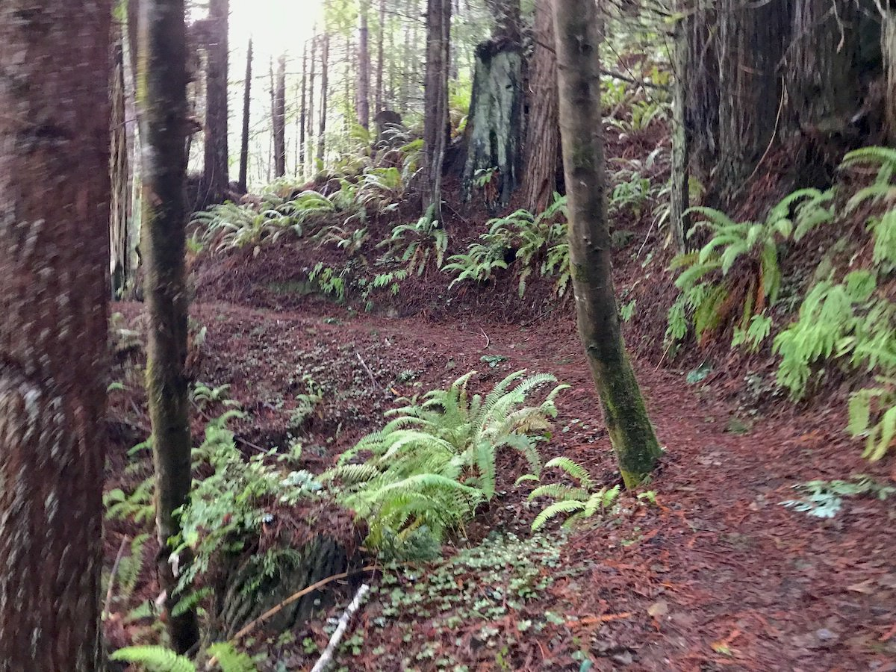

This hike starts at the Elk River Trailhead, which is at the end of Elk River Road just south of Eureka, California. The exit from US 101 is marked with a brown sign indicating the Headwaters Forest Preserve, so it's pretty easy to find. The drive to the trailhead is about six miles from the US 101 exit.

**Distance**: 11.00 miles  
**Time**: 3:17:22  
**Starting Elevation**: 87 ft  
**Peak Elevation**: 1357 ft  
**Total Elevation**: 2257 ft

I recommend NOT leaving any valuables in your vehicle while you're hiking. It's always good practice, but this particular location is notorious for theft since it's far enough away from the highway, doesn't have reliable cell service, and doesn't have any security cameras. I had an encounter with someone which resulted in my driving down the road to call the police during one of the two times I've been there.

The trail starts of on a paved pathway through the woods which follows the meandering Elk River. The first half mile is accessible to just about anyone – which makes it a popular walking route. After about a mile, the pavement turns into a wide gravel path. The further you head up the river, the less foot traffic you'll see, and it number of people drops off dramatically after the first mile and a half or so.

There's an old bike rack on the side of the trail at mile 3.

Just after mile 3, you'll get to a bridge that crosses the Elk River. This makes for a nice place to get some water and empty out the rocks in your boots because the path starts to head uphill into the forest, and you'll feel your heart rate jump soon after.

The part of the trail between the bridge and the loop through the area of giant old growth redwoods seems a lot longer that it really. I think that part of it is the anticipation of seeing those old things, and another part is the pace is likely reduced because of the elevation gain. Nonetheless, this part of the hike is pretty fun as it twists and turns through the trees on a path of soft-packed redwood needles.

Once you get to the loop through the big tree area, you'll see some behemoth trees. Unfortunately, this is the only part of the hike where you'll see them.

<iframe src="maps/hikes/2019-12-25-map.html" height="600" width="100%" frameborder="0"></iframe>
