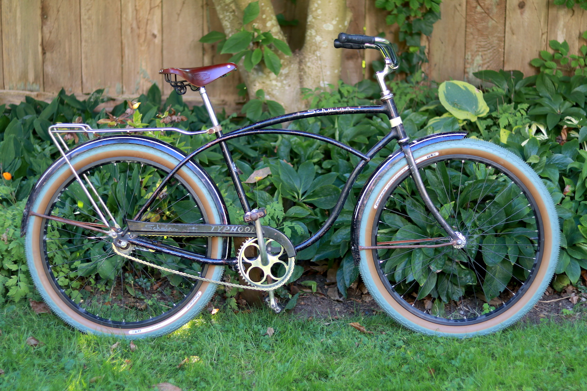
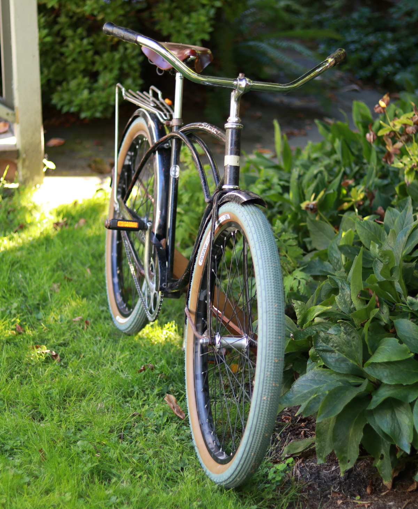

I recently finished rebuilding my grandfather's Schwinn Typhoon. The project involved, taking the entire bike apart, regreasing all of the headset and crankset bearings, cleaning and polishing metal pieces, and reassembling the whole thing with modern parts where necessary. I didn't repaint or chrome anything, and like how the "garage" look turned out.

The most major alteration I made on this bike is the new 26" wheel set. I removed the original Schwinn S-7 26" wheels so I could add some more modern tires. This did require a minor bit of grinding from the front fork to make room for a larger axle width, but otherwise it was a fairly painless procedure. Since the newer wheel size is slightly smaller than the old one, I was able to use the extra space between the rims and the fenders for larger tires.

The current tires are Panaracer Gravel King SK (26" x 2.10) Limited Editions. These are totally overkill for this bike, but I liked the look. The 2.10 width is about max, especially on fenders that aren't totally straight. I had to bang them back in place where they rubbed on the sides of the tires. I also removed the middle fender brace on the rear since that was a problem spot for tire rubbing. I widened the bottom rear part of both fenders with a mallet, and gave them new rivets to better hold the bottom fender braces. Now they're sturdy and wide enough to fit extra-fat tires.

One of the harder choices I made was to keep the old Ashtabula one-piece crank rather than fit it with an adapter for a new bottom bracket. This would have allowed me to put on a newer crankset, pedals, etc. But I felt that this part was pretty integral to the whole character of the bike. Plus, these old Schwinns don't need any real fancy additions – they're good as-is for some lazy riding. I never intend to take this on a tour or use it in a race.

Finding 1/2" pedals (as opposed to modern 9/16") has been the biggest headache. There don't seem to be many high-quality pedals in this size. I ended up rummaging the bins of [Our Community Bikes](http://pedalpower.org/) and found a decent pair I can live with, but I'd like to find some 1/2" to 9/16" adapters so I can put on some nicer chrome MKSs.

The 13/16" to 7/8" seat post is made by Wald, and is topped with a Velo seat clamp. Attached to that is the Brooks B72 saddle.

[Sheldon Brown's site](https://www.sheldonbrown.com/harris/opc.html) was of huge importance in demystifying old Schwinn bike component sizing, and whether or not anything could be replaced for modern parts. [RJ The Bike Guy](https://www.youtube.com/channel/UCaAK2FaxQ2xiBbAUVZsvDYQ) always seems to have a YouTube video ready for me when I wonder how to rebuild or recombobulate an older part.
