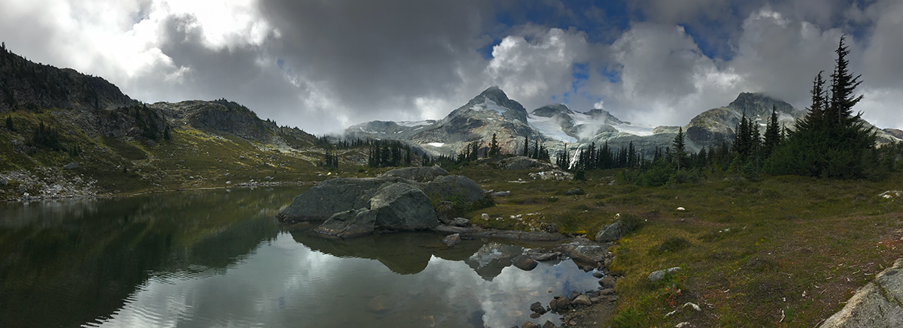
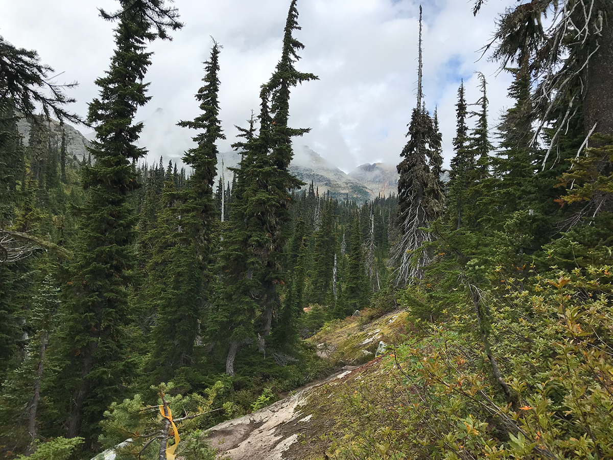

## Overview

Semaphore Lakes are several glacial lakes located in Southwestern British Columbia, and are a somewhat overlooked destination for a day hike from Vancouver.

  |-----------------+------------+-----------------+----------------+----------------|
  | Distance | Duration | Elevation Change  | Difficulty  | Trail Type |
  |-----------------|------------|-----------------|----------------|----------------|
  | 11.57 Miles | 5:24 | 1200 Feet     | Moderate    | Mostly rocky      |
  |-----------------+------------+-----------------+----------------+----------------|

 <video width="720" controls>
  <source src="https://media.githubusercontent.com/media/ect123/ect123.github.io/main/img/semaphore-lakes/gold-bridge-road-720.mp4" type="video/mp4">
  Your browser does not support the video tag.
</video> 

